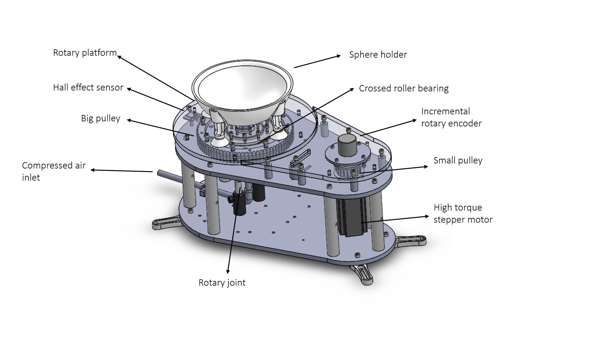

# RPM - a Rotation Platform for head-fixed Mice
## Overview
This device provides vestibular stimulation for head-fixed experiments in mice. It can be combined with different physiological and behavioural recording modalities. It follows a modular, low-cost and open-source model.
This documentation provides the assembly and operation guide for users with some experience in rapid manufacturing, electronics and development boards/microcontrollers, such as Arduino.

In the accompanying paper [(link_goes_here)](), we show use cases for pupil tracking and recording head-direction cell activity during rotation. 

|  |
|:--:|
| *Figure 1. Main components of the rotation platform* |
## Features
- fully open source
- low cost
- easy to assemble
- modular design, modules can be added depending on experimental needs

## Main components
The main components of the stage are labelled in the figure above. The rotary platform is actuated by a stepper motor using a timing belt. An incremental encoder is coupled with the motor shaft to measure the angular position, while a Hall effect sensor is used for homing purposes. Compressed air keeps a polystyrene sphere floating without friction inside the sphere holder. The crossed roller bearing holds the rotating and non-rotating parts together. The rotary joint enables multiple electric connections between the rotary platform and the base. The device is intended for behavioural experiments combined with extracellular recording and optogenetics. There are two operating modes: closed-loop and open-loop. In closed-loop mode, the sphere's rotation on the horizontal (yaw) axis is measured using an optical sensor and is used to generate a motor rotation of an adjustable magnitude in the opposite direction. In open-loop mode, motor rotation is independent of the animal’s movement and can be controlled by the experimenter.