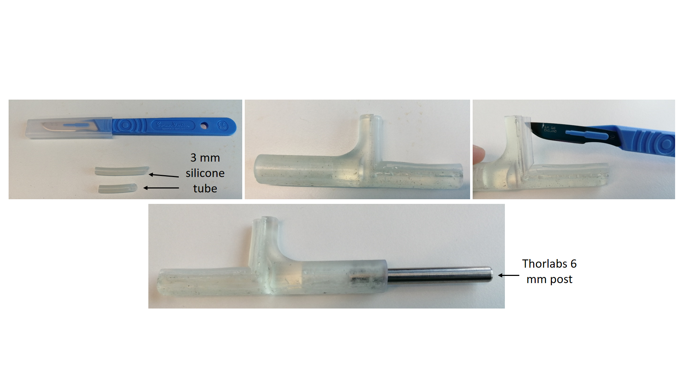
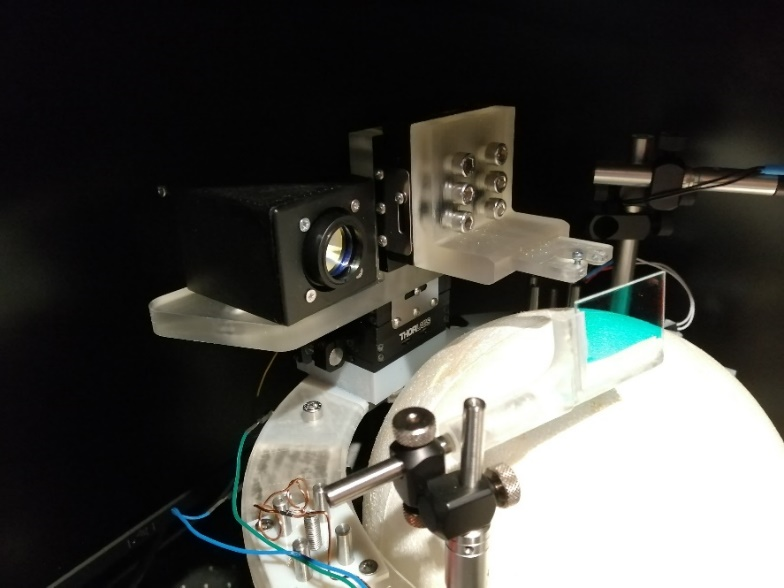

# Assembly instructions

-	Cut 2 pieces of silicone tube to similar lengths as the mirror edges (36 mm and 25 mm).
-	Glue both parts into the mirror holder.
-	Use a scalpel to make a longitudinal cut along both tubes.
-	Insert a 6 mm diameter Thorlabs post into the mirror holder.

|  |
|:--:|
| *Figure 1. Mirror holder assembly* | 

-	Use a 3D printing material with opaque features (e.g. FormLabs black resin). If using clear resin, use black matt spray to block out external light. 
-	Use 4 M2 screws and nuts to attach the camera to the camera holder.
-	Insert the filter, mounted on a CP35/M and an SM1L03 lens tube in the filter holder. Use 4 M3 screws to attach it to the filter holder cover.
-	Use two long (25-30 mm) M3 screws as shafts to open and close the filter holder.	

|  |
|:--:|
| *Figure 2. Camera and filter holder assembly* | 

-	Use an M6 screw and nut to attach the camera holder to the MT1/M linker with the camera holder lip found in the "Instrument ring and head holder" section.

|  |
|:--:|
| *Figure 3. Camera assembly to head-fixation system* | 

-	Attach the mirror holder to the instrument ring or the rotation platform using Thorlabs components (e.g. RA90TR/M and 12.7 mm post).
-	Mount the head fixation system onto the instrument ring.

|  |
|:--:|
| *Figure 4. Camera and mirror* | 