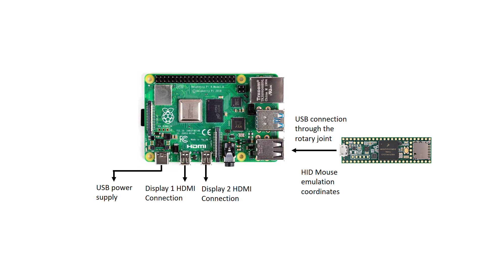

# Raspberry Pi

The VR environment runs on a Raspberry Pi 4 Modell B located on the platform, running Raspbian 10 (Buster). The Pi is connected to the screens via micro HDMI cables. The Raspberry Pi is powered through one of the USB cables on the slip ring, using a USB to USB-C adaptor. The Teensy USB port is directly connected to one of the USB ports of the Raspberry Pi. Connections are indicated below

|  |
|:--:|
| *Figure 1. Connections to Raspberri Pi4* | 
# Sensor input through USB
The optical sensor inputs transformed on the Teensy to calculate the motor displacement are converted using the [Mouse HID Library](https://www.pjrc.com/teensy/td_mouse.html) included in Teensyduino, and transmitted to the Raspberry Pi via USB using the Mouse.move(x, y) function. The Teensy USB port should be set up as a HID + Serial (select the USB mode in Tools -> USB type -> Serial + Keyboard + mouse + joystick when uploading the code using Arduino IDE). 

# Godot

## Compilation instructions
Godot 3.2 is compiled from source using clang. After installing clang and any required libraries (see [here](https://docs.godotengine.org/en/stable/development/compiling/compiling_for_x11.html)), clone and install Godot using the commands below:

```
git clone https://github.com/godotengine/godot
cd godot
git checkout 3.2-stable
scons platform=x11 target=release_debug tools=yes use_llvm=yes CCFLAGS="-mtune=cortex-a72 -mcpu=cortex-a72 -mfloat-abi=hard -mfpu=neon-fp-armv8" -j4
sudo cp bin/godot.x11.opt.tools.32.llvm /usr/bin/godo
```

## Environment

The 3D environment is created in Godot. The camera position is updated using a script written in GDScript, relative to the movements of the emulated mouse carrying the optical sensor input.
The game is run via a bash script that ensures the game is running in full-screen mode across the two monitors.
The (x,y) coordinates of the player within the environment are automatically saved in a csv file. 

The virtual corridor is available [to download here](files/corridor-master.zip)

[The video linked here](https://vimeo.com/829853010) shows a proof-of-principle experiment, where an untrained mouse in navigating on the setup. At the top, a camera behind (and to the right of) the mouse shows the snout, whiskers and the screens. At the bottom, a camera above the setup shows the mouse, the styrofoam ball and the top edge of the screens (helpful to see the physical rotation). The red line in the bottom right shows the trajectory of the animal in VR space.
