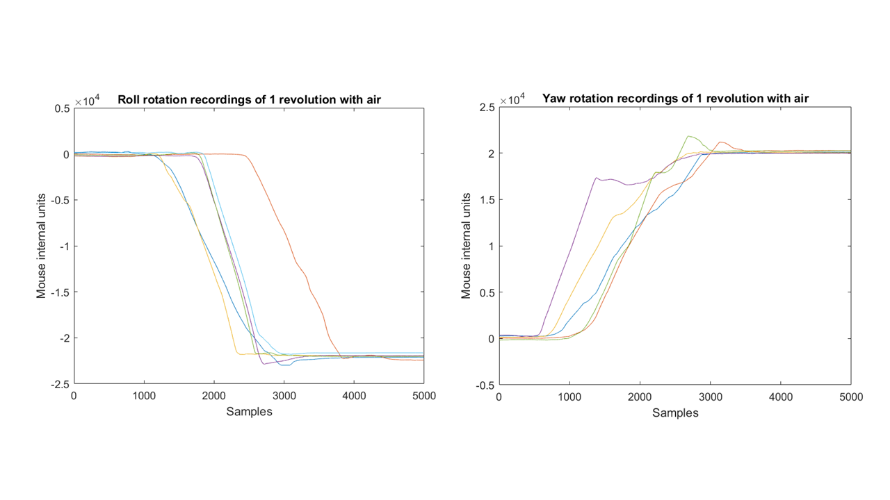

# Characterization

Before calibration, the position of the sensor must be adjusted to align with the sphere's equator vertically. Then the horizontal position can be adjusted until a SQUAL value of approximately 50 is achieved.
Several recordings of 5 seconds at 1000 Hz were performed to characterize the perimeter measured by the sensor and establish the relationship between the actual and measured perimeter. Two sensors were used, and separate recordings were made rotating the sphere around the yaw and roll axes (Figure 1).

|  |
|:--:|
| *Figure 1. SQUAL value recordings for both axes* |

|  |
|:--:|
| *Figure 2. Distribution of the SQUAL values on each axis* |

The results show a homogeneous distribution of the SQUAL value depending on the relative distance change (Figure 3).

|  |
|:--:|
| *Figure 3. Relationship between relative displacements and the SQUAL value* |

The calibration was performed by repeating several measurements of one revolution for the roll and yaw axes (n = 6 and n = 5, respectively). For each recording, the sphere has been rotated by hand for one revolution using an external mark. 

|  |
|:--:|
| *Figure 4. Recordings of absolute displacements in roll and yaw axes of one revolution* | 

As shown in Figure 4, for both axes the recordings converge towards a final value. The conversion factor between mouse internal units and sphere displacement is the average of this absolute final value for both axes (n = 11). The average was 21,966 for the roll axis and 20,109 mouse internal units for the yaw axis, giving a final average of 21,038 mouse internal units for a perimeter of 61.89 cm, hence a conversion factor of 339.92 mouse internal units per cm.