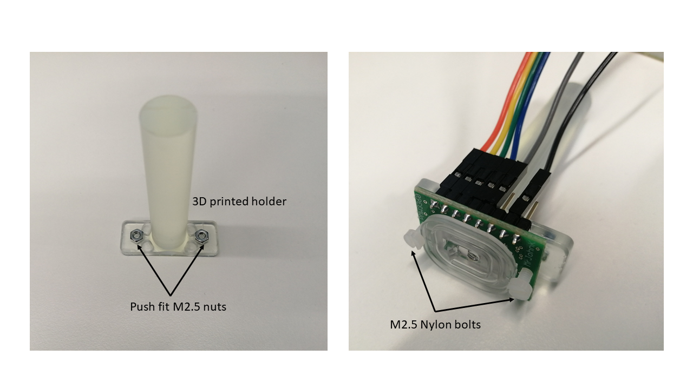

# Components

The PMW3360 has exceptional capabilities: high motion detection for speeds up to 635 cm/s and acceleration up to 50G. The register outputs the SQUAL value, a reference of the quality of the surface. The sensor is available for purchase from JACK Enterprises in Tindie [[1]](#references). To control it you must download the PWM3360 library [[2]](#references). 

The breakout board has the essential pins available and distributed in a way that makes it easy to connect:

- VI = 3.3V
- MI = MISO0 -or- DIN
- MO = MOSI0 -or- DOUT
- SC = SCK0 -or- SCK
- SS = CS0 -or- CS
- GD = GND

The holder can be 3D printed ([STL file](files/STL/PWM3360%20holder.stl) and [STP file](files/STP/PWM3360%20holder.stp)) and be used with the Thorlabs parts described for the other sensors (ADNS 2610 and 3050). To attach the sensor to the holder, two M2.5 16 mm pan head screws and two M2.5 nuts are needed. The nuts can be pressed to fit on the holder, and the bolts will hold the lens against the sensor without needing glue (Figure 1).

|  |
|:--:|
| *Figure 1. 3D printed holder and assembly* |

# References
[1] [https://www.tindie.com/products/jkicklighter/pmw3360-motion-sensor/](https://www.tindie.com/products/jkicklighter/pmw3360-motion-sensor/)

[2] [https://github.com/SunjunKim/PMW3360](https://github.com/SunjunKim/PMW3360)